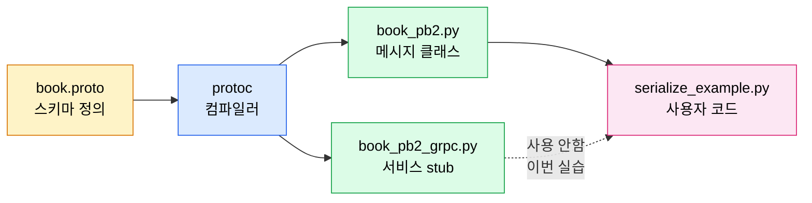
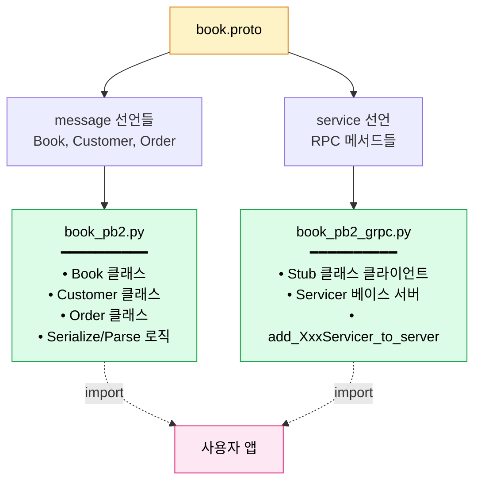
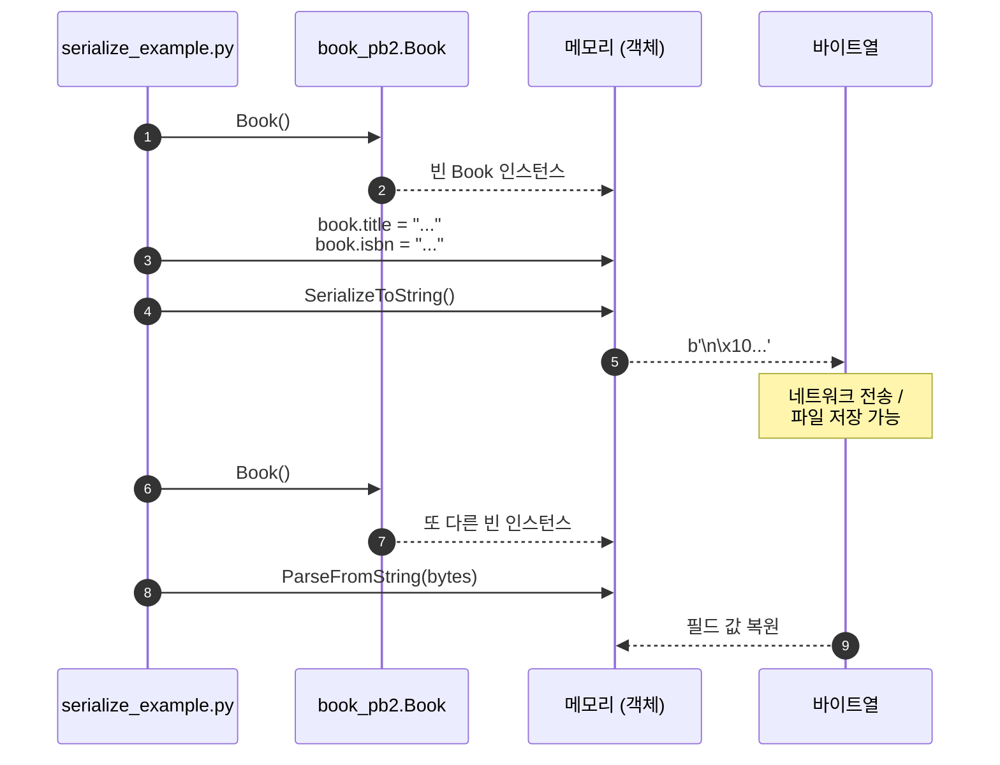
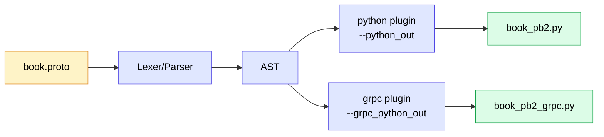
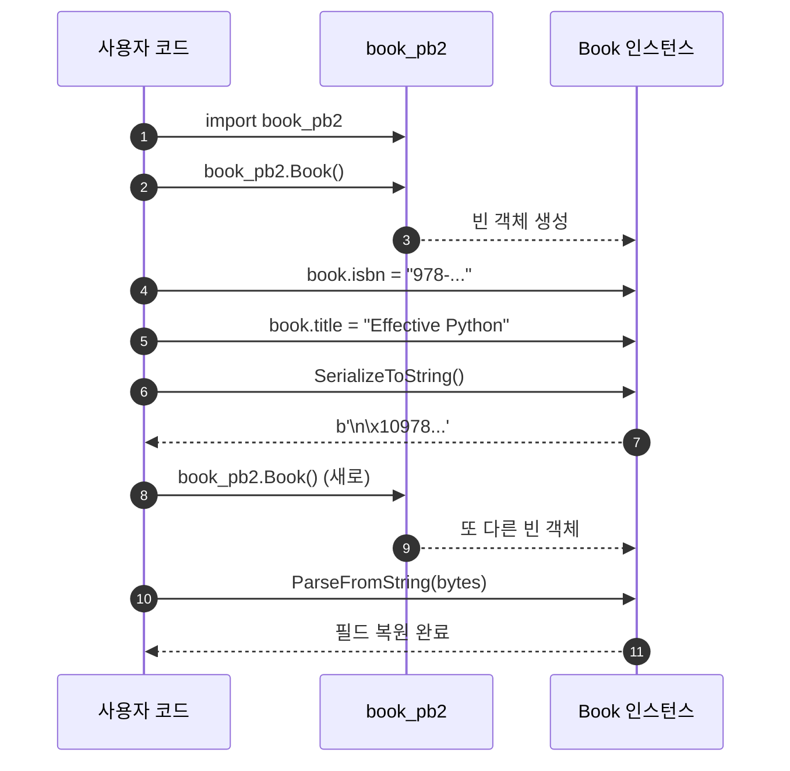
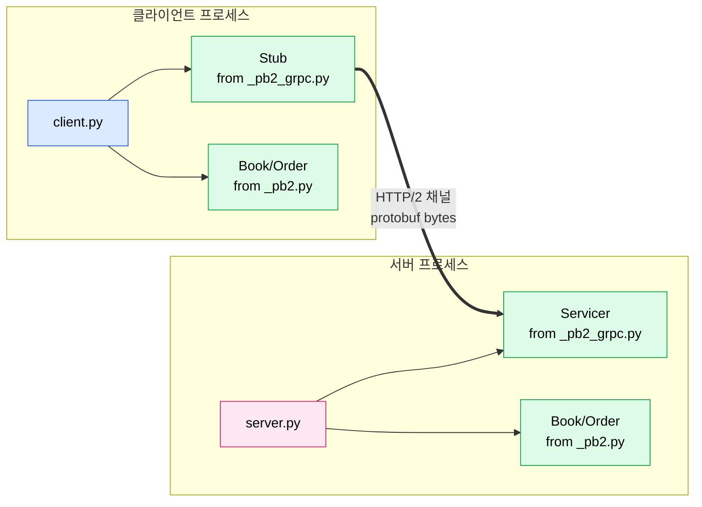
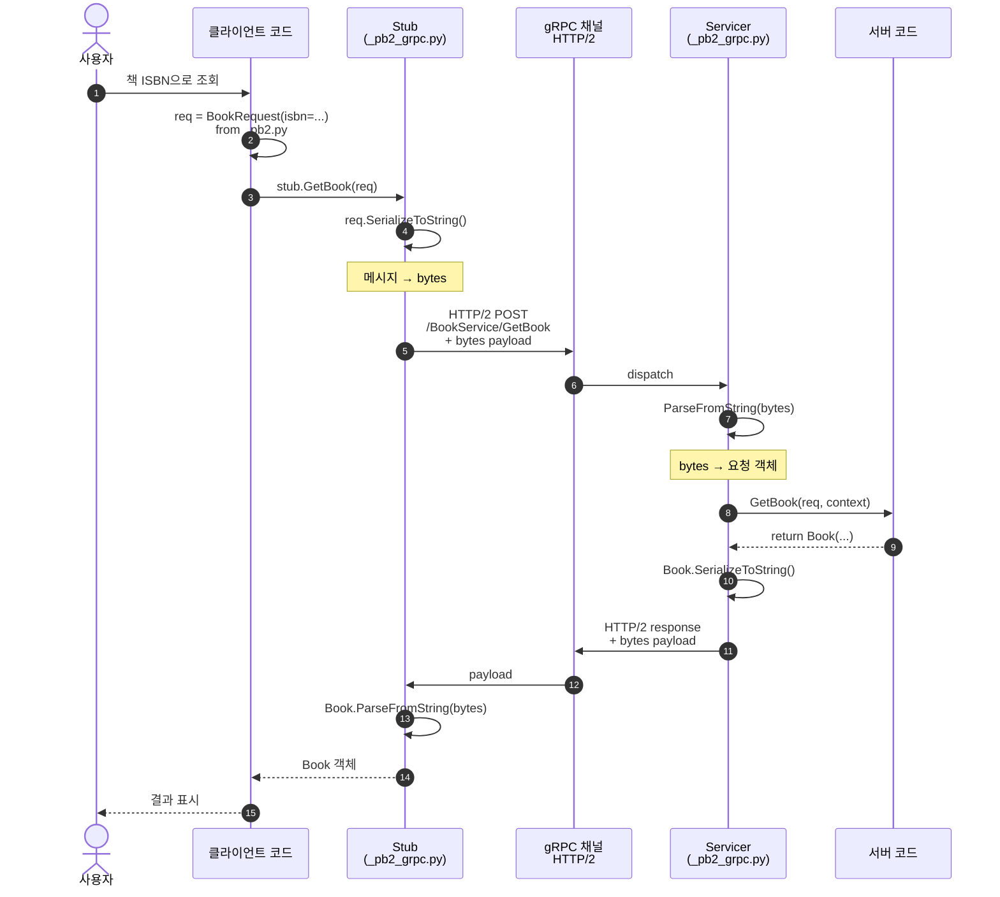
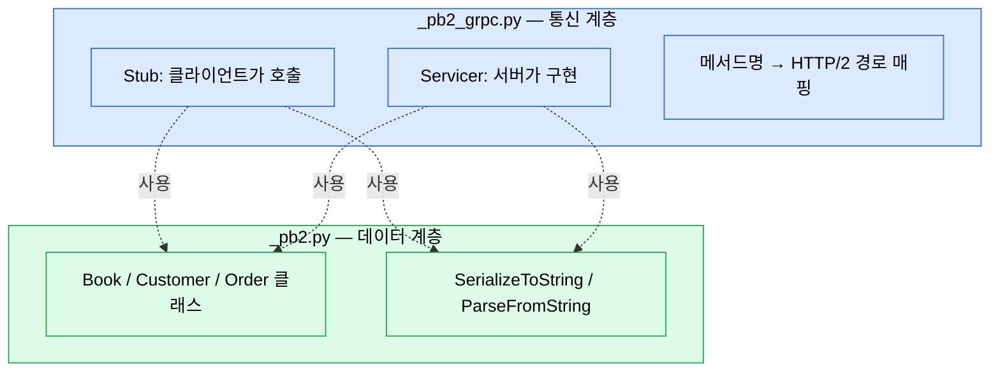
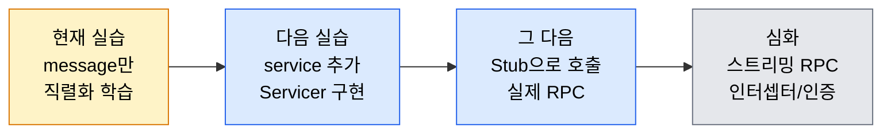

# 실습 구조와 흐름

`1_bookstore` 실습이 어떻게 구성되어 있고, 각 단계에서 무엇이 일어나는지 설명하는 문서.

---

## 1. 전체 구조

```
1_bookstore/
│
├── book.proto                ← [입력]   사람이 작성하는 메시지 정의
│
├── book_pb2.py               ← [생성]   protoc가 만든 메시지 클래스
├── book_pb2_grpc.py          ← [생성]   protoc가 만든 gRPC stub (이번엔 비어있음)
│
├── serialize_example.py      ← [실행]   생성된 클래스를 사용하는 Python 코드
│
└── docs/
    ├── 1_실행-가이드.md       ← 명령어/실행 절차
    └── 2_구조와-흐름.md       ← 개념 설명 (이 문서)
```

세 종류의 파일이 있습니다:

| 종류 | 누가 작성 | 역할 |
|------|----------|------|
| `.proto` | **개발자** | 데이터 스키마 정의 (언어 무관) |
| `*_pb2.py` / `*_pb2_grpc.py` | **protoc 컴파일러** | Python에서 사용할 클래스 자동 생성 |
| `*.py` (사용자 코드) | **개발자** | 생성된 클래스를 import해서 실제 로직 작성 |



---

## 2. 왜 두 파일(`_pb2.py`, `_pb2_grpc.py`)이 생성되는가

protoc는 `.proto` 안의 **두 가지 다른 종류의 선언**을 처리합니다:

| 선언 | 무엇을 정의하나 | 어디로 가나 |
|------|----------------|-------------|
| `message` | **데이터 구조** (필드, 타입) | `book_pb2.py` |
| `service` | **호출 가능한 RPC** (메서드 시그니처) | `book_pb2_grpc.py` |



### 분리하는 이유 (관심사 분리)

1. **데이터는 서비스 없이도 쓸 수 있다**
   - 파일 저장, Kafka 메시지, DB 직렬화 등에서 protobuf 메시지만 쓰는 경우가 많음
   - 이때 `_pb2_grpc.py`는 필요 없음 → 의존성을 최소화

2. **gRPC가 아닌 다른 RPC도 가능**
   - 같은 `message`를 쓰면서 서비스만 다른 RPC 프레임워크(예: Twirp, Connect)로 바꿀 수 있음
   - `_pb2.py`는 그대로, `_pb2_grpc.py`만 다른 파일로 교체

3. **언어별 plugin 독립성**
   - protoc 본체는 `message` 코드만 생성 → `_pb2.py`
   - gRPC plugin이 별도로 동작 → `_pb2_grpc.py`
   - C++/Go/Java도 똑같은 패턴

4. **import 그래프 최적화**
   - 클라이언트는 `_pb2_grpc.py`(Stub 사용) 필요
   - DTO만 쓰는 모듈은 `_pb2.py`만 import → 빌드/로딩 가벼움

> **이번 실습에서 `book.proto`에는 `service`가 없으므로 `_pb2_grpc.py`는 거의 비어있습니다.** 다음 실습에서 `service`를 추가하면 비로소 의미를 갖게 됩니다.

---

## 3. 데이터 흐름 한눈에 보기


### 직렬화/역직렬화 시퀀스



핵심: **`.proto`가 계약서**, **`_pb2.py`가 그 계약을 구현한 Python 클래스**, **`serialize_example.py`가 그 클래스를 사용하는 앱**.

---

## 4. 단계별 동작

### 1단계 — `.proto` 작성

`book.proto`는 **데이터 구조를 선언**할 뿐, 코드는 아닙니다.

```proto
message Book {
    string isbn = 1;
    string title = 2;
    ...
}
```

읽는 법:
- `message Book` — `Book`이라는 타입을 정의
- `string isbn = 1;` — `isbn`이라는 문자열 필드, **필드 번호 1**
- 필드 번호는 바이너리에서 필드를 식별하는 ID (이름이 아님)

### 2단계 — 컴파일 (protoc 실행)

```bash
uv run python -m grpc_tools.protoc -I. --python_out=. --grpc_python_out=. book.proto
```

내부적으로 일어나는 일:



생성 결과:

- **`book_pb2.py`** — `Book`, `Customer`, `Order` 클래스. 각 클래스는:
  - `SerializeToString()` — 객체 → bytes
  - `ParseFromString(data)` — bytes → 객체
  - 필드 setter/getter, `__str__`, `__eq__` 자동 구현

- **`book_pb2_grpc.py`** — 서비스가 있다면 `XxxStub`(클라이언트용)과 `XxxServicer`(서버용) 코드.

### 3단계 — Python 코드 실행



#### (a) 객체 생성과 데이터 입력
```python
book = book_pb2.Book()
book.title = "Effective Python"
```

#### (b) 직렬화
```python
serialized_book = book.SerializeToString()
# b'\n\x10978-0134685991\x12\x10Effective Python...'
```

#### (c) 역직렬화
```python
deserialized_book = book_pb2.Book()
deserialized_book.ParseFromString(serialized_book)
```

#### (d) 중첩 / repeated
```python
order = book_pb2.Order(
    customer=customer,
    items=[book],
)
```

---

## 5. 두 파일을 이용한 gRPC 통신 (다음 실습 미리보기)

이번 실습엔 `service`가 없지만, 실제 gRPC 시스템에서 두 파일이 어떻게 협력하는지 알아둡시다.

### 시스템 구성



**관찰 포인트**: 양쪽 모두 **같은 `_pb2.py`/`_pb2_grpc.py`** 를 임포트합니다 — `.proto` 라는 계약을 공유하기 때문.

### 파일별 역할 분담

| 파일 | 클라이언트에서 | 서버에서 |
|------|---------------|---------|
| `book_pb2.py` | 요청 메시지 객체 생성 + 응답 객체 받기 | 요청 객체 받기 + 응답 객체 생성 |
| `book_pb2_grpc.py` | **`BookServiceStub`** 사용 (호출자) | **`BookServiceServicer`** 상속 (구현자) |

### 호출 시퀀스

`service BookService { rpc GetBook (BookRequest) returns (Book); }` 가 있다고 가정:



### 핵심 통찰



`_pb2_grpc.py`는 **`_pb2.py`를 import해서 사용**합니다. 즉:
- 데이터 계층(`_pb2`)은 통신 없이도 독립
- 통신 계층(`_pb2_grpc`)은 데이터 계층에 **의존**

---

## 6. 각 단계의 "왜?"

| 단계 | 왜 이렇게 하는가 |
|------|----------------|
| `.proto` 별도 파일 | 언어 독립적 계약. 같은 `.proto`로 Python/Go/Java 모두 코드 생성 가능 |
| 컴파일러로 코드 생성 | 직렬화 로직을 사람이 손으로 짤 필요 없음. 스키마 변경 시 재생성만 |
| 필드 번호 사용 | 이름이 바뀌어도 호환됨. 번호만 유지하면 됨 (버전 진화 안전) |
| 바이너리 포맷 | JSON 대비 3~10배 작고, 파싱이 빠름 |
| 직렬화/역직렬화 분리 | 네트워크 전송 / 파일 저장 / DB 캐싱 등 어디서든 재사용 |
| `_pb2` / `_pb2_grpc` 분리 | 메시지만 쓰는 케이스도 많음. 통신 계층은 옵션 |

---

## 7. 흔한 함정

| 증상 | 원인 | 해결 |
|------|------|------|
| `No module named 'book_pb2'` | 컴파일을 안 했거나 다른 폴더에서 실행 | `protoc` 먼저 실행, `cd 1_bookstore` |
| `ModuleNotFoundError: grpc_tools` | 시스템 Python으로 실행 중 | `uv run` 붙이기 |
| `Expected "returns"` | `.proto` 문법 오류 (예: `return` → `returns`) | proto3 문법 확인 |
| `Could not make proto path relative: book.proto1` | 파일명 오타 / 끝에 잡문자 | 명령어 마지막 인자 확인 |
| `Missing input file` / `command not found` | 명령어가 여러 줄로 잘림 | 한 줄로 입력하거나 `\`로 줄바꿈 |
| `book_pb2.book()` 에러 | 클래스명은 **대문자** | `book_pb2.Book()` |

---

## 8. 다음 단계



1. `.proto`에 `service` 추가 — RPC 메서드 선언
2. `book_pb2_grpc.py`에 생성되는 `Servicer` 상속해서 서버 구현
3. `Stub`을 이용해 클라이언트에서 호출
4. gRPC 채널로 실제 네트워크 통신

이때 `book_pb2_grpc.py`가 비로소 의미를 갖게 됩니다.

---

## 한 줄 요약

> **`.proto` 정의 → `protoc`로 두 파일 생성 (`_pb2`=데이터, `_pb2_grpc`=통신) → 양쪽이 같은 데이터 계약을 공유해 직렬화/역직렬화로 안전하게 통신** — 이게 protobuf + gRPC의 전체 사이클입니다.
